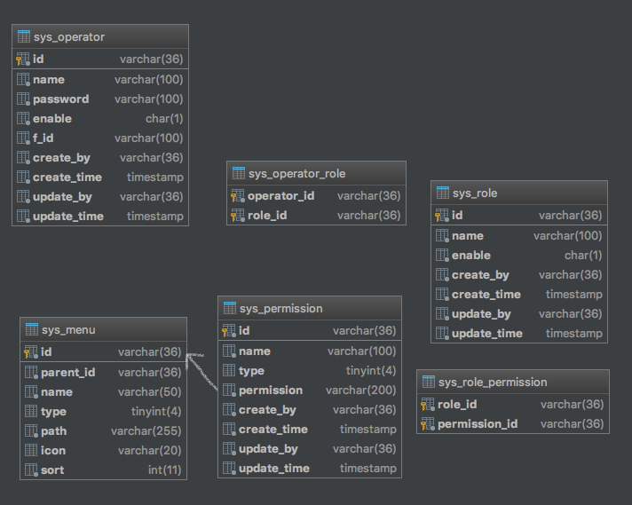
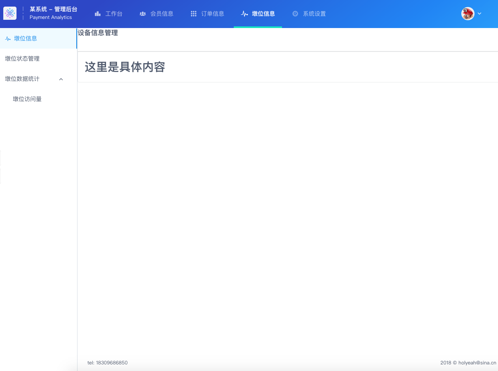

# egg-rbac-mysql

强依赖数据库表结构的自动鉴权和菜单结构的插件。使用mysql数据库基于rbac鉴权，用户、角色、权限、菜单关系均由表管理。

## 安装

```bash
$ npm i egg-rbac-mysql --save
```

## 配置

```js
// {app_root}/config/plugin.js
exports.rbac = {
  enable: true,
  package: 'egg-rbac-mysql',
};

// {app_root}/config/config.default.js
// 以下配置是为自动鉴权使用，不需要自动鉴权时，可不配置。
  exports.rbac = {
    // 匹配需要自动鉴权校验的路径。
    matchPattern: /^\/admin/,
    // 上面匹配路径下，不需要自动鉴权校验的路径。
    escapeUrl: [ '/admin', '/admin/logout' ],
    // 鉴权失败时，渲染的异常页面。
    errorPage: '/admin/error',
    // 鉴权失败时，渲染异常页面所提供的数据。
    errorMessage: {
      error: {
        code: 401,
        msg: '没有访问权限',
      },
    },
  };
```

## 使用

#### 1. 按照rbac规范定义数据表结构，具体见rbac-init.sql脚本

   

#### 2. 插件根据permission和menu表关系构建具有层次的完整菜单数组和简化不分层级的菜单数组。分别存入app.menus和app.liteMenu，理论上支持无线级别的菜单列表，实际上3级菜单就已经很深了。


```json
// app.menus结果样例
[{
    "menu_id": "1",
    "menu_parent_id": "-1",
    "menu_name": "工作台",
    "menu_path": "/admin/dashboard",
    "menu_icon": "ios-podium",
    "permission_id": "1",
    "permission_name": "工作台",
    "sort": 0
}, {
    "menu_id": "2",
    "menu_parent_id": "-1",
    "menu_name": "会员信息",
    "menu_path": "/admin/wxmember",
    "menu_icon": "ios-people",
    "permission_id": "2",
    "permission_name": "会员信息",
    "sort": 1
}, {
    "menu_id": "3",
    "menu_parent_id": "-1",
    "menu_name": "订单信息",
    "menu_path": "/admin/order",
    "menu_icon": "ios-keypad",
    "permission_id": "3",
    "permission_name": "订单信息",
    "sort": 2
}, {
    "menu_id": "4",
    "menu_parent_id": "-1",
    "menu_name": "墩位信息",
    "menu_path": "/admin/device",
    "menu_icon": "ios-pulse",
    "permission_id": "4",
    "permission_name": "墩位信息",
    "sort": 3,
    "sub_menu": [{
        "menu_id": "6",
        "menu_parent_id": "-1,4",
        "menu_name": "墩位状态管理",
        "menu_path": "/admin/device/status",
        "menu_icon": "",
        "permission_id": "6",
        "permission_name": "墩位状态管理",
        "sort": 0
    }, {
        "menu_id": "7",
        "menu_parent_id": "-1,4",
        "menu_name": "墩位数据统计",
        "menu_path": "folder",
        "menu_icon": "",
        "permission_id": "7",
        "permission_name": "墩位数据统计",
        "sort": 1,
        "sub_menu": [{
            "menu_id": "8",
            "menu_parent_id": "-1,4,7",
            "menu_name": "墩位访问量",
            "menu_path": "/admin/device/analytics/visit",
            "menu_icon": "",
            "permission_id": "8",
            "permission_name": "墩位访问量",
            "sort": 0
        }, {
            "menu_id": "9",
            "menu_parent_id": "-1,4,7",
            "menu_name": "墩位报修量",
            "menu_path": "/admin/device/analytics/maintain",
            "menu_icon": "",
            "permission_id": "9",
            "permission_name": "墩位报修量",
            "sort": 1
        }]
    }]
}, {
    "menu_id": "5",
    "menu_parent_id": "-1",
    "menu_name": "系统设置",
    "menu_path": "/admin/setting",
    "menu_icon": "ios-cog-outline",
    "permission_id": "5",
    "permission_name": "系统设置",
    "sort": 4
}]

// app.liteMenu结果样例
[{
    "menu_id": "1",
    "menu_parent_id": "-1",
    "menu_path": "/admin/dashboard",
    "permission_id": "1"
}, {
    "menu_id": "2",
    "menu_parent_id": "-1",
    "menu_path": "/admin/wxmember",
    "permission_id": "2"
}, {
    "menu_id": "3",
    "menu_parent_id": "-1",
    "menu_path": "/admin/order",
    "permission_id": "3"
}, {
    "menu_id": "4",
    "menu_parent_id": "-1",
    "menu_path": "/admin/device",
    "permission_id": "4"
}, {
    "menu_id": "5",
    "menu_parent_id": "-1",
    "menu_path": "/admin/setting",
    "permission_id": "5"
}, {
    "menu_id": "6",
    "menu_parent_id": "-1,4",
    "menu_path": "/admin/device/status",
    "permission_id": "6"
}, {
    "menu_id": "7",
    "menu_parent_id": "-1,4",
    "menu_path": "folder",
    "permission_id": "7"
}, {
    "menu_id": "8",
    "menu_parent_id": "-1,4,7",
    "menu_path": "/admin/device/analytics/visit",
    "permission_id": "8"
}, {
    "menu_id": "9",
    "menu_parent_id": "-1,4,7",
    "menu_path": "/admin/device/analytics/maintain",
    "permission_id": "9"
}]
```

#### 3. 根据登录用户自动判断权限。需要在登录时将用户数据处理成类似如下结构，放入ctx.session.user中。（主要是permissions属性，这里面放的是sys_permission表的permission字段，对应sys_menu表的id，自动鉴权逻辑就是根据请求地址，查询liteMenu对应的menu_id，再根据menu_id和这里的permission对比的）

```json
{
    "id": "074e04e0-bae9-11e8-98a6-9dd5135ca7bb",
    "f_id": "",
    "login_name": "test",
    "roles": [{
        "id": "admin",
        "name": "超级管理员"
    }],
    "permissions": ["1", "2", "3", "4", "5", "6", "7", "8"]
}
```

## 举个例子

先上效果图



路由router.js

```javascript
  router.resources('admin', '/admin', nonAuthorize, controller.admin.home);

  router.get('/admin/logout', controller.admin.home.logout);

  router.get('/admin/dashboard', authorized, controller.admin.dashboard.index);

  router.get('/admin/wxmember', authorized, controller.admin.dashboard.index);

  router.get('/admin/order', authorized, controller.admin.dashboard.index);

  router.get('/admin/device', authorized, controller.admin.device.index);

  router.get('/admin/device/status', authorized, controller.admin.device.index);

  router.get('/admin/setting', authorized, controller.admin.dashboard.index);
```

用户登录校验中间件，把user、menus和已经打开的菜单id组成了onMenu，放入了ctx.locals

```javascript
// nonAuthorize.js
'use strict';
module.exports = () => {
  return async function nonAuthorize(ctx, next) {
    if (typeof ctx.session.user !== 'undefined' && ctx.session.user != null) {
      if (ctx.session.user.id !== '' && ctx.session.user.login_name !== '' && ctx.session.user.roles.length > 0) {
        ctx.locals.user = ctx.session.user;
        ctx.locals.menus = ctx.app.menus;
        for (const mp of ctx.app.liteMenu) {
          if (mp.menu_path === ctx.path) {
            ctx.locals.onMenu = {
              id: mp.menu_id,
              hid: mp.menu_parent_id === '-1' ? mp.menu_id : mp.menu_parent_id.split(',')[1],
            };
            break;
          }
        }
        await ctx.redirect('/admin/dashboard');
      } else {
        await next();
      }
    } else {
      await next();
    }
  };
};

// authorized.js
'use strict';
module.exports = () => {
  return async function authorized(ctx, next) {
    if (typeof ctx.session.user !== 'undefined' && ctx.session.user != null) {
      if (ctx.session.user.id !== '' && ctx.session.user.login_name !== '' && ctx.session.user.roles.length > 0) {
        ctx.locals.user = ctx.session.user;
        ctx.locals.menus = ctx.app.menus;
        for (const mp of ctx.app.liteMenu) {
          if (mp.menu_path === ctx.path) {
            ctx.locals.onMenu = {
              id: mp.menu_id,
              hid: mp.menu_parent_id === '-1' ? mp.menu_id : mp.menu_parent_id.split(',')[1],
            };
            break;
          }
        }
        await next();
      } else {
        await ctx.redirect('/admin');
      }
    } else {
      await ctx.redirect('/admin');
    }
  };
};
```

登录controller，将user放入session

```javascript
async login() {
    const { ctx, service, logger } = this;
    const username = ctx.request.body.username;
    const password = ctx.request.body.password;
    const res = await service.admin.home.doLogin(username, password);
    if (typeof res === 'string') {
      logger.warn(`${username}登录认证失败：${res}`);
      ctx.session.user = null;
      await ctx.render('/admin/home', { warning: res });
      return;
    }
    logger.info(`${username} is arrival.`);
    ctx.session.user = res;
    await ctx.redirect('/admin/dashboard');
  }
```

登录service，查询用户的角色和权限，并构建用户结构见上面的user.json

```javascript
async doLogin(loginname, password) {
    const { app, ctx, service, config, logger } = this;
    const rows = await app.mysql.query('select so.id, so.f_id, sor.role_id, srp.permission_id, so.enable operator_enable, sr.enable role_enable, so.name login_name, sr.name role_name, sp.name permission_name, sp.permission permission_symbol from sys_operator so, sys_operator_role sor, sys_role sr, sys_role_permission srp, sys_permission sp where so.id = sor.operator_id and sor.role_id = sr.id and sr.id = srp.role_id and srp.permission_id = sp.id and so.name =? and so.password = ?', [ loginname, password ]);
    if (rows.length !== 0) {
      if (rows[0].operator_enable !== 'T') {
        return '该用户已被禁用';
      }
      const operator = {
        id: rows[0].id,
        f_id: rows[0].f_id,
        login_name: rows[0].login_name,
      };
      const roleMap = new Map();
      const permissionSet = new Set();
      for (const row of rows) {
        if (row.role_enable !== 'T') {
          continue;
        }
        if (!roleMap.has(row.role_id)) {
          roleMap.set(row.role_id, {
            id: row.role_id,
            name: row.role_name,
          });
        }
        permissionSet.add(row.permission_symbol);
      }
      operator.roles = [ ...roleMap.values() ];
      operator.permissions = Array.from(permissionSet);
      return operator;
    }
    return '账户不存在或用户名/密码不正确';
  }
```

基础布局baseLayout.nj（使用nunjucks改了{{ }}为{$ $}，iview框架的非 template/render 模式）

```html
<!DOCTYPE html>
<html>
<head>
    <meta charset="utf-8">
    <meta name="viewport" content="width=device-width, initial-scale=1.0">
    <meta http-equiv="X-UA-Compatible" content="ie=edge">
    <title>管理后台</title>
    <link rel="stylesheet" type="text/css" href="https://unpkg.com/iview@3.1.0/dist/styles/iview.css">
    <link rel="stylesheet" href="/public/css/layout.css">
     
</head>
<body>
<Layout id="app">
    <i-header>
        <i-menu mode="horizontal" theme="sky" active-name="1">
            <a class="header-logo" href="/admin">
                
                
                <div class="title">
                    <h3>某系统 - 管理后台</h3>
                    <h4>Payment Analytics</h4>
                </div>
            </a>
            
            <div class="header-aside">
                <Submenu name="1">
                    <template slot="title">
                        <Avatar src="/public/images/supermario.png" />
                    </template>
                    <menu-item name="1-1">编辑资料</menu-item>
                    <menu-item name="1-2" on-select="logout"><a href="/admin/logout">退出</a></menu-item>
                </Submenu>
            </div>
        </i-menu>
    </i-header>
    
    <div class="filter">
    
    <h3>欢迎使用</h3>
    
    </div>
    <i-content class="content">
        
        <Card>
            <div>
            <h1>没有内容</h1>
            </div>
        </Card>
        
        <div class="footer">
            <row>
                <i-col span='12'>
                    tel: 18309686850
                </i-col>
                <i-col span='12'>
                    <p>2018 &copy; holyeah@sina.cn</p>
                </i-col>
            </row>
        </div>
    </i-content>
</Layout>
<script type="text/javascript" src="https://unpkg.com/vue@2.5.17/dist/vue.min.js"></script>
<script type="text/javascript" src="https://unpkg.com/iview@3.1.0/dist/iview.min.js"></script>
 
</body>
</html>
```

头部菜单headerMenu.nj，构建菜单使用了menus和user的permissions属性，仅显示用户有权限的菜单

```html
<div class="header-items">
    
    
    <menu-item name="{$ menu.menu_id $}">
        <a href="{$ menu.menu_path $}" class="{$ 'on' if menu.menu_id==onMenu.hid else '' $}">
            <Icon type="{$ menu.menu_icon $}"></Icon>&nbsp;&nbsp;<span>{$ menu.menu_name $}</span>
        </a>
    </menu-item>
    
    
</div>
```

左侧菜单siderMenu.nj，构建菜单遍历menus时，判断是否有submenu属性，进一步便利，此处的左侧菜单仅2层，无限层得递归。

```html
<Sider hide-trigger>

    
    <i-menu active-name="{$ onMenu.id $}" theme="light" width="auto">
        <menu-item name="{$ menu.menu_id $}" to="{$ menu.menu_path $}">
           <Icon type="{$ menu.menu_icon $}"></Icon>{$ menu.menu_name $}
        </menu-item>
        
        
        
        <menu-item name="{$ submenu.menu_id $}" to="{$ submenu.menu_path $}">
            <Icon type="{$ submenu.menu_icon $}"></Icon>{$ submenu.menu_name $}
        </menu-item>
        
        <Submenu name="{$ submenu.menu_id $}">
            <template slot="title">
                <Icon type="{$ submenu.menu_icon $}"></Icon>{$ submenu.menu_name $}
            </template>
            
            
            <menu-item name="{$ subsubmenu.menu_id $}" to="{$ subsubmenu.menu_path $}">
                <Icon type="{$ subsubmenu.menu_icon $}"></Icon>{$ subsubmenu.menu_name $}
            </menu-item>
            
            
        </Submenu>
        
        
        
        
    </i-menu>
    

</Sider>
```

## Questions & Suggestions

Please open an issue [here](https://github.com/Gearace/egg-rbac-mysql/issues).

## License

[MIT](https://mit-license.org/)
